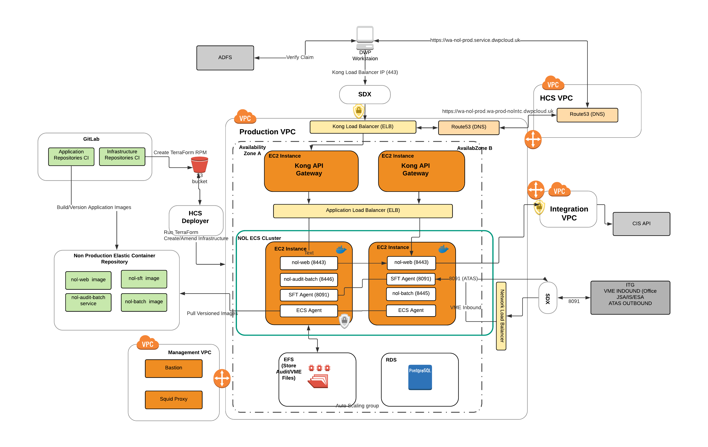
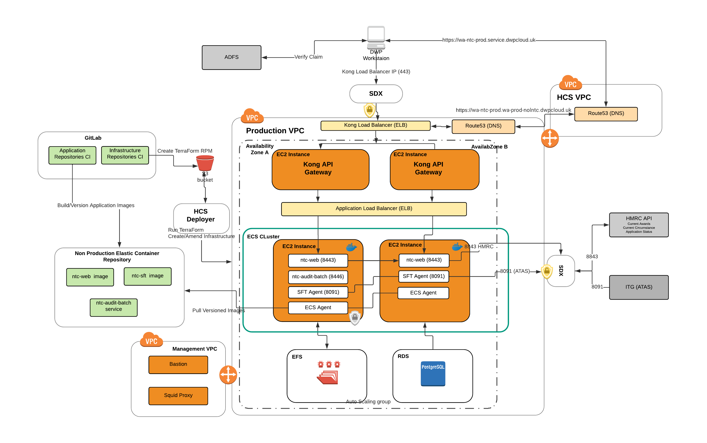

# NOLNTC Terraforms
Terraform project to create the underying architecture for NOL-R (Notifications Online Remediated) and NTC-R (New Tax Credits Remediated).

This project contains the following Terraform stacks with their own remote state for each environment (dev, test, staging and production).

- **Network**. (VPC Creation, Routing, Subnets and Squid Proxy)
- **NOL Stack**. (EC2 Instances, ECS Cluster, Load Balancers, ECS Tasks)
- **NTC Stack**. (EC2 Instances, ECS Cluster, Load Balancers, ECS Tasks)
- **Kong NOL Stack**. Used for Single Sign On / ADFS (EC2 Instances, Autoscaling Group)
- **Kong NTC Stack**. Used for Single Sign On / ADFS (EC2 Instances, Autoscaling Group)
- **Core**. - Common currently stack used for peering with the Integration VPC and Route 53
- **HCS Deployer Scripts**. - Scripts to be used by the HCS Deployer Lambda for deploying new applications.

### Network Layer
* VPC Creation
* Routing
* Subnets 
* Bastion 
* Squid Proxy (For access to ECR) 
* Peering Shared Services Peering
* Peering Shared Internet Services 
* Peering Shared Management 

### NOL and NOL Kong Layers
The following diagram shows a high level overview of the NOL-R AWS Architecture.
At a high level the NOL stack creates

### NTC and NTC Kong Layers
The following diagram shows a high level overview of the NTC-R AWS Architecture

### Certifcates
Mutual Auth Certifciates and Keys are required for the interfaces between
- **CIS** (via the Integration VPC) - for CIS Calls from NOL-R to validate the Notifications Nino
- **SDX** For Single File Transfer (SFT). Receiving VME files from ITG 
The following Certifcates and Keys have been uploaded to the parameter store in production using aws cli.

| Parameter                       | Description                         | Comments                                                                                 | Expiry | Category |
|---------------------------------|-------------------------------------|------------------------------------------------------------------------------------------|--------|----------|
| /NOLNTC/NOLNTC_ROOT_CA_CRT      | NOLNTC Root CA                      | Used to Sign CSRs from SDX                                                               |   Jan 20 13:15:29 2039     | SDX      |
| /NOLNTC/NOLNTC_ROOT_CA_KEY      | Private Key for Root CA             | Used to Sign CSRs from SDX                                                               |        | SDX      |
| /NOLNTC/NOLNTC_ROOT_CA_SRL      | Serial for Root CA                  | Used to Sign CSRs from SDX                                                               |        | SDX      |
| /NOLNTC/SDX_V3                  | V3 Config for SDX Mutual Auth       | Used to Sign CSRs from SDX. Contains IPs                                                 |        | SDX      |
| /NOLNTC/NOLNTC_SFT_CRT          | Cert for SFT Keystore               | Result of signing CSR from PDU for Mutual Auth                                           |   Feb  7 17:07:35 2021     | SDX      |
| /NOLNTC/NOLNTC_SFT_KEY          | Private Key for SFT Keystore        |                                                                                          |        | SDX      |
| /NOLNTC/NOLNTC_SFT_ATAS_IP_PORT | The IP and Port of the SDX Endpoint |                                                                                          |        | SDX      |
| /NOLNTC/NOL/CIS_KEY             | Used for CIS SOAP call              | Result of generating CSR for Integration Team                                            |        | CIS      |
| /NOLNTC/NOL/CIS_CERT            | Used for CIS SOAP call              | Certificate Signed by Integration team.  Received by PDU after PDU has generated CSR.    |   Feb  7 15:56:33 2020     | CIS      |
| /NOLNTC/NOL/CIS_ROOT_CA         | Used for CIS SOAP call              | Supplied by the Integration Team in response to the CSR long with the Signed Certificate |        | CIS      |
| /NOLNTC/NOL/CIS_ROOT_CA         | Supplied by the Integration Team    |                                                                                          |        | CIS      |

### Monitoring

The monitoring stack is based on the monitoring template maintained by HCS. In order for alerting to work the following 
parameters must exist:

 /monitor/dev/hcs-alertmanager/username
 /monitor/dev/hcs-alertmanager/password